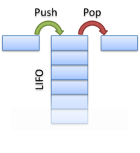

**Стек** (от англ. _stack_ — стопка) — структура данных, представляющая из себя упорядоченный набор элементов, в которой добавление новых элементов и удаление существующих производится с одного конца, называемого вершиной стека. Притом первым из стека удаляется элемент, который был помещен туда последним, то есть в стеке реализуется стратегия «последним вошел — первым вышел» (last-in, first-out — LIFO). Примером стека в реальной жизни может являться стопка тарелок: когда мы хотим вытащить тарелку, мы должны снять все тарелки выше. Вернемся к описанию операций стека:

- empty𝑒𝑚𝑝𝑡𝑦 — проверка стека на наличие в нем элементов,
- push𝑝𝑢𝑠ℎ (запись в стек) — операция вставки нового элемента,
- pop𝑝𝑜𝑝 (снятие со стека) — операция удаления нового элемента.


В Go можно реализовать стек с использованием встроенных структур данных, таких как срезы (slices) или связанные списки. Вот пример реализации стека с использованием среза:
```
package main

import (
    "fmt"
)

type Stack struct {
    items []interface{}
}

func (s *Stack) Push(item interface{}) {
    s.items = append(s.items, item)
}

func (s *Stack) Pop() interface{} {
    if len(s.items) == 0 {
        return nil
    }
    popped := s.items[len(s.items)-1]
    s.items = s.items[:len(s.items)-1]
    return popped
}

func (s *Stack) Peek() interface{} {
    if len(s.items) == 0 {
        return nil
    }
    return s.items[len(s.items)-1]
}

func main() {
    stack := Stack{}
    stack.Push(1)
    stack.Push(2)
    stack.Push(3)

    fmt.Println("Stack after pushes:", stack)

    fmt.Println("Popped item:", stack.Pop())
    fmt.Println("Stack after pop:", stack)

    fmt.Println("Peeked item:", stack.Peek())
    fmt.Println("Stack after peek:", stack)
}
```


В PHP уже есть реализация стека в https://www.php.net/manual/ru/book.spl.php